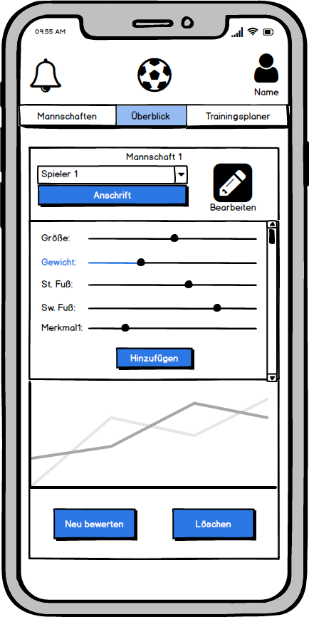

# Anforderungs- und Entwurfsspezifikation ("Pflichtenheft")

* Titel, Autoren, Inhaltsverzeichnis
* Link zum Source Code Repository

# 1 Einführung

## 1.1 Beschreibung
    - Projektname
    - Darstellung der Produktvision in Prosa (5-10 Sätze)

Projektname: Coacher

Coacher soll ein Verwaltungstool von Fußballmanschaften für Trainer sein. Der Trainer kann seine Mannschaft anlegen und die Spieler verwalten (Name, Nummer, Merkmale, Notizen, Entwicklung) und bewerten. Ebenfalls kann der Trainer Trainingseinheiten anlegen. Für diese kann er auf vorhandene Übungen zurückgreifen oder selber neue zeichnen. Diese Übungen sind kommentierbar (Schwierigkeit, Schwerpunkt, Anmerkungen).  

Übungen können veröffentlicht werden und von anderen Trainern genutzt werden. Andere Trainer können die Übung kommentieren und bewerten. 

## 1.2 Ziele

    - Anwendungsbereiche, Motivation, Umfang, Alleinstellungsmerkmale, Marktanforderungen
    - Informationen zu Zielbenutzergruppen und deren Merkmale (Bildung, Erfahrung, Sachkenntnis)
    - Abgrenzung (Was ist das Softwaresystem _nicht_)

Die Anwendung soll Fußballtrainer bei der Verwaltung der Mannschaft und dem Planen von Trainingseinheiten und der Taktik unterstützen. Um die Mannschaft zu Verwalten, kann der Trainer eine Spielerliste anlegen, für die er verschiedene Merkmale eintragen kann. Bei manchen dieser Merkmale ist es möglich eine Historie zu verfolgen, um eine Entwicklung des Spielers verfolgen zu können.

Zum Planen der Trainingseinheiten und der Taktik steht ein Zeichnungsbereich zur Verfügung, in dem selbständig Übungen gezeichnet werden können. Der Trainer kann das Training aber auch aus bereits gespeicherten oder auch von anderen Trainern veröffentlichten Übungen zusammen setzen.

Die Software soll keine Verwaltung von Seiten der Spieler bereitstellen. Diese können keine Termine pflegen oder ihre Statistik nachgucken. 

Auf dem aktuellen Markt, gibt es einige Anbieter von vergleichbarer Software. Ein großer Anbieter ist easy2Coach. Hier erhält man alle von unseren Funktionen und zusätzlich eine Verwaltung von den Spielern. Die Anwendung ist für die Spieler kostenlos, kostet den Trainer allerdings pro Saison ca. 100€. Dieser Preis ist pro Team, hat ein Trainer also zwei Mannschaften, zahlt er auch dementsprechend.

Die hohen Kosten haben auch alle anderen Anwendungen auf dem Markt. Oder die Anwendungen sind kostenlos, bieten dafür allerdings auch nur einen Bruchteil von unseren Funktionen. So ist es zum Beispiel bei dem öffentlichen Grafiktool vom DFB so, dass nur eine Übung gezeichnet werden kann. Die Übungen müssen dann sogar noch per Hand zusammengefügt werden, z.B. per Word. Eine Datenbank mit Übungen von anderen Trainern steht nicht zur Verfügung.

Die Anwendung soll sich an Fußballtrainer richten. Diese sind über alle Altersstufen verteilt. Die Zielgruppe reicht also von Jugendlichen bis in das hohe Rentenalter hinein. Die Vorkenntnisse können deswegen stark abweichen.  

# 2 Anforderungen

## 2.1 Stakeholder

| Funktion | Name | Kontakt | Verfügbarkeit | Wissen  | Interesse & Ziele  | Relevanz  |
|---|---|---|---|---|---|---|
| Fußballtrainer | Herr Poppe | 015234060392 | per WhatsApp immer | gute Vorkenntnisse, kennt andere Software, soll mit dem System arbeiten | strukturierte Trainingsplanung, einfache Mannschaftsverwaltung | fachlicher Entscheider |

## 2.2 Funktionale Anforderungen
    - Use-Case Diagramme
    - Strukturierung der Diagramme in funktionale Gruppen

### Teammanager

### Trainingplaner

### Training

## 2.3 Nicht-funktionale Anforderungen 

### 2.3.1 Rahmenbedingungen
    - Normen, Standards, Protokolle, Hardware, externe Vorgaben

### 2.3.2 Betriebsbedingungen
    - Vorgaben des Kunden (z.B. Web Browser / Betriebssystem Versionen, Programmiersprache)

Die Anwendung muss auf den aktuellen Browsern von Firefox, Chrome und Edge funktionieren. Des weiteren sollen die letzten drei Betriebssysteme, Stand April 2019, von Apple und Android mit Hilfe einer App unterstützt werden.

### 2.3.3 Qualitätsmerkmale

    - Externe Qualitätsanforderungen (z.B. Performance, Sicherheit, Zuverlässigkeit, Benutzerfreundlichkeit)

Qualitдtsmerkmal | sehr gut | gut | normal | nicht relevant
---|---|---|---|---
**Zuverlässigkeit** | | | | 
Fehlertoleranz |-|-|X|-
Wiederherstellbarkeit |-|-|X|-
Ordnungsmäßigkeit |X|-|-|-
Richtigkeit |X|-|-|-
Konformität |-|-|-|X
**Benutzerfreundlichkeit** | | | | 
Installierbarkeit |-|-|X|-
Verständlichkeit |X|-|-|-
Erlernbarkeit |X|-|-|-
Bedienbarkeit |X|-|-|-
**Performance** | | | | 
Zeitverhalten |-|-|X|-
Effizienz|-|-|-|X
**Sicherheit** | | | | 
Analysierbarkeit |-|-|X|-
Modifizierbarkeit |-|-|X|-
Stabilität |-|X|-|-
Prüfbarkeit |-|-|X|-

## 2.4 Graphische Benutzerschnittstelle
    - GUI-Mockups passend zu User Stories
    - Screens mit №berschrift kennzeichnen, die im Inhaltsverzeichnis zu sehen ist
    - Unter den Screens darstellen (bzw. verlinken), welche User Stories mit dem Screen abgehandelt werden
    - Modellierung der Navigation zwischen den Screens der GUI-Mockups als Zustandsdiagramm

### Web

#### Login

#### Register

#### Home Mannschaften

#### Home - Mannschaft - Übersicht

#### Home - Mannschaft - Bewertung

#### Home - Planer 

#### Home - Planer - Datenbank - Informationen

#### Home - Planer - Datenbank - Kommentieren

#### Übergangsdiagramm

### Mobile

#### Login

#### Register

#### Home Mannschaften

#### Mannschaften Statistik

#### Planer 

#### Übungsview

#### Übergangsdiagramm

## 2.5 Anforderungen im Detail

    - User Stories mit Akzeptanzkritierien 
    - Optional: Name (oder ID) und Prioritдt ("Must", "Should", "Could", "Won't")
    - Strukturierung der User Stories in funktionale Gruppen

### User Stories

#### Teammanagment

| **Als** | **möchte ich**                         | **so dass**                               | **Akzeptanz**                          |
| :------ | :------------------------------------- | :---------------------------------------- | :------------------------------------- |
| Trainer | ein Team erstellen können              | ich dieses Verwalten kann                 | Team wird erstellt                     |
| Trainer | ein Team löschen können                | dieses nicht mehr existiert               | Team nicht mehr angezeigt              |
| Trainer | einen Spieler zu einem Team hinzufügen | dieser verwaltet werden kann              | Spieler ist im Team vorhanden          |
| Trainer | einen Spieler aus einem Team entfernen | dieser nicht mehr vorhanden ist           | Spieler nicht mehr aufgelistet         |
| Trainer | weitere Trainer zum Team hinzufügen    | diese das Team verwalten können           | Trainer ist Team zugewiesen            |
| Trainer | einen Trainer entfernen                | dieser das Team nicht mehr verwalten kann | Trainer ist Team nicht mehr zugewiesen |
| Trainer | ein Team löschen können                | dieses Team nicht mehr vorhanden ist      | Team wird nicht angezeigt              |

#### Trainingsplaner

| **Als** | **möchte ich**                              | **so dass**                                 | **Akzeptanz**                  |
| :------ | :------------------------------------------ | :------------------------------------------ | :----------------------------- |
| Trainer | ein Training erstellen                      | ich dieses ?                                | Training vorhanden             |
| Trainer | Trainingselemente auswählen können          | ich diese platzieren kann                   | Trainingselemente auswählbar   |
| Trainer | Trainingselemente frei platzieren können    | ich ein gutes Training erstellen kann       | Trainingselemente platzierbar  |
| Trainer | platzierte Trainingselemente bewegen können | ich Positionen korrigieren kann             | Trainingselemente verschiebbar |
| Trainer | Trainingselemente entfernen können          | ich nicht benutze Elemente entfernen kann   | Trainingselement gelöscht      |
| Trainer | Spieler auf dem Plan platzieren             | ich eine Formation planen kann              | Spieler auf dem Feld platziert |
| Trainer | Freitext auf dem Plan platzieren            | ich Notizen für das Training schreiben kann | Freitext schreiben             |
| Trainer | den Plan als Bild Exportieren               | ich diesen den Spielern präsentieren kann   | Bild aus Plan erstellt         |

#### Training

| **Als** | **möchte ich**                              | **so dass**                                            | **Akzeptanz**                                    |
| :------ | :------------------------------------------ | :----------------------------------------------------- | :----------------------------------------------- |
| Trainer | eine Liste aller angelegten Trainings sehen | ich diese nutzen kann                                  | Liste aller Trainings sichtbar                   |
| Trainer | ein Training bewerten                       | ich erkennen kann ob dieses Training gut ist           | Training ist mit gut, mittel, schlecht bewertbar |
| Trainer | ein Training kommentieren                   | der Ersteller Kommentare/Vorschläge erhalten kann      | Kommentar zur Trainingseinheit schreibbar        |
| Trainer | eine Liste aller Kommentare sehen           | ich Probleme oder Unklarheiten erkenne                 | Liste aller Kommentare wird angezeigt            |
| Trainer | ein Training kopieren können                | ich eine Abwandlung vom existierenden entwickeln kann  | Training wurde kopiert                           |
| Trainer | ein Training bearbeiten                     | ich die Trainingseinheit verbessern kann               | Training wird in Bearbeitungsmaske geöffnet      |
| Trainer | ein Training Löschen                        | dieses nicht mehr vorhanden ist                        | Training wird nicht mehr angezeigt               |
| Trainer | einen Spieler auf dem Training platzieren   | ich Spielzüge planen kann                              | Spielername kann platziert werden                |
| Trainer | Spieler nach dem Training bewerten          | ich eine Statistik über den Status habe                | Spieler mit gut, mittel, schlecht bewertbar      |
| Trainer | Spieler nach dem Training kommentieren      | ich mir Notizen zu verhalten und Situation machen kann | Freitext für den Spieler im Training vorhanden   |
| Trainer | Spieler allgemein bewerten                  | ich Team übergreifende Bewertungen habe                | Spieler mit gut, mittel, schlecht bewertbar      |
| Trainer | Spieler allgemein kommentieren              | ich Team übergreifende Notizen habe                    | Freitext für den Spieler vorhanden               |

#### Zusatz

| **Als** | **möchte ich**                                  | **so dass**                                                | **Akzeptanz**                         |
| ------- | ----------------------------------------------- | ---------------------------------------------------------- | ------------------------------------- |
| Trainer | Im Webbrowser die Anwendung nutzen können       | ich Ohne etwas zu installieren ein Training erstellen kann | Anwendung ist im Chrome lauffähig     |
| Trainer | beim Training meine Trainingspläne sehen können | ich Bewertungen und Kommentare direkt eintragen kann       | Anwendung ist unter Android lauffähig |

# 3 Technische Beschreibung

## 3.1 Systemübersicht
    - Systemarchitekturdiagramm ("Box-And-Arrow" Diagramm)
    - Kommunikationsprotokolle, Datenformate

## 3.2 Softwarearchitektur

    - Darstellung von Softwarebausteinen (Module, Schichten, Komponenten)

## 3.3 Schnittstellen
    - Schnittstellenbeschreibung
    - Auflistung der nach außen sichtbaren Schnittstelle der Softwarebausteine

<https://app.swaggerhub.com/apis/AHeinisch/trainingsplaner/1.0.0>

## 3.4 Datenmodell 

    - Konzeptionelles Analyseklassendiagramm (logische Darstellung der Konzepte der Anwendungsdomäne)
    - Modellierung des physikalischen Datenmodells 
      - RDBMS: ER-Diagramm bzw. Dokumentenorientiert: JSON-Schema

## 3.5 Abläufe

    - Aktivitätsdiagramme für relevante Use Cases
    - Aktivitätsdiagramm für den Ablauf sämtlicher Use Cases

### Spieler bewerten

### Übung zeichnen

## 3.6 Entwurf

    - Detaillierte UML-Diagramme für relevante Softwarebausteine

### Enums

__Merkmal.Typ__

- Größe
- Gewicht
- Schusskraft
- Schusstechnick
- Rechter Fuß
- Linker Fuß
- Angriffskopfball
- Verteidigungskopfball
- Kurzpassspiel
- Langpassspiel
- Flanken
- 1vs1 - Verteidigung
- 1vs1 - Angriff
- Taktisches Verhalten - Angriff
- Taktisches Verhalten - Verteidigung
- Ballan- und mitnahme
- Dribbeltempo
- Torwartspiel - Strafraum
- Torwartspiel - Hechten linke Seite
- Torwartspiel - Hechten rechte Seite
- Torwartspiel - Fangen
- Torwartspiel - Fausten
- Torwartspiel - Abstoss
- Torwartspiel  - Abschlag
- Torwartspiel - Werfen

__Trainer.Lizenz__

- C-Lizenz
- B-Lizenz
- A-Lizenz
- UEFA-Jugendcoach
- Fußballlehrer

__Uebung.Kategorie__

- Aufwärmen
- Spielform
- Passübung
- Dribbelübung
- Koordination
- Kondition
- Torschuss
- Kraftübung

__Übung.Schwerpunkt__

- Passspiel
- Ballan - mitnahme
- Torschuss
- 1vs1 - Angriff
- 1vs1- Verteidigung
- Überzahl Angriff
- Überzahl Vertiedigung
- Unterzahl Angriff
- Unterzahl Verteidigung
- Taktik
- Flanken

__Uebungselement.Typ__

- Ball
- Hütchen
- Tor
- Spieler
- Torwart
- gestrichelter Pfeil
- durchgezogener Pfeil
- geschwungener Pfeil
- Stange
- Hürde

__Team.Altersklasse__

- U5
- U6
- U7
- U8
- U9
- U10
- U11
- U12
- U13
- U14
- U15
- U16
- U17
- U18
- U19
- U21
- Herren
- Damen
- Ü32
- Ü40
- Ü50

__Team.Liga__

- Kreisliga
- Kreisklasse
- Bezirksliga
- Landesliga
- Verbandsliga
- Oberliga
- Regionalliga
- 3. Bundesliga
- 2. Bundesliga
- 1. Bundesliga

# 4 Projektorganisation

## 4.1 Annahmen
    - Nicht durch den Kunden definierte spezifische Annahmen, Anforderungen und Abhängigkeiten
    - Verwendete Technologien (Programmiersprache, Frameworks, etc.)
    - Aufteilung in Git-Repositories gemäß Software- und Systemarchitektur und Softwarebbausteinen 
    - Einschrдäkungen, Betriebsbedingungen und Faktoren, die die Entwicklung beeinflussen (Betriebssysteme, Entwicklungsumgebung)
    - Interne Qualitätsanforderungen (z.B. Softwarequalitätsmerkmale wie z.B. Erweiterbarkeit)

Die Anwendung ist Stand-Alone, das heißt in diesem Zusammenhang, dass keine weiteren Apps oder Anwendungen benötigt werden. Das Web-Frontend soll in Angular programmiert werden. Das mobile Frontend basiert auf Angular, wird allerdings über Ionic programmiert. In beiden Frontends wird State-Managment über Ngrx gelöst.

Das Backend basiert auf .NetCore und ist in C# programmiert. Die Datenbank ist in MySQL erstellt.

Anforderung für die Software ist, dass die Tests durchlaufen.

## 4.2 Verantwortlichkeiten

    - Zuordnung von Personen zu Softwarebausteinen aus Kapitel 3.1 und 3.2
    - Rollendefinition und Zuordnung

| Softwarebaustein | Person(en) |
|----------|-----------|
| Web-Frontend | Dario Leunig |
| Mobile-Frontend | Nikolai Kloss |
| Backend | Alexander Heinisch |
| Authentifizierung | Pascal Turon |
| Continuous Integration | Alexander Bergmann |
| State Managment | Patrick Poppe |

### Rollen

#### Softwarearchitekt
Entwirft den Aufbau von Softwaresystemen und trifft Entscheidungen über das Zusammenspiel der Softwarebausteine.

#### Frontend-Entwickler
Entwickelt graphische oder andere Benutzerschnittstellen, insbesondere das Layout einer Anwendung.

#### Backend-Entwickler
Implementiert die funktionale Logik der Anwendung. Hierbei werden zudem diverse Datenquellen und externe Dienste integriert und fьr die Anwendung bereitgestellt.

#### Infrastrukturmanager

Implementiert Tools und Umgebungen für die Einhaltung einer kontinuierlichen Entwicklung

### Rollenzuordnung

| Name     | Rolle     |
|----------|-----------|
| Dario Leunig | Frontend-Entwickler |
| Nikolai Kloss | Frontend-Entwickler |
| Patrick Poppe | Frontend-Entwickler |
| Pascal Turon | Backend-Entwickler |
| Alexander-Heinisch | Backend-Entwickler |
| Alexander Bergamnn | Infrastrukturmanagers |

## 4.3 Grober Projektplan
    - Meilensteine

### Meilensteine
* KW 22 - Abgabe MVP
  * Anmeldung funktioniert
  * Training kann gezeichnet werden
  * Browser, IOS, Android	
* KW 26 - Valides Produkt
  * Use Cases  umgesetzt
* KW 28 - Softwareübergabe
  * Tests abgeschlossen
  * Bugs beseitigt 		

# 5 Anhänge

## 5.1 Glossar 
    - Definitionen, Abkürzungen, Begriffe

## 5.2 Referenzen
    - Handbücher, Gesetze

## 5.3 Index

